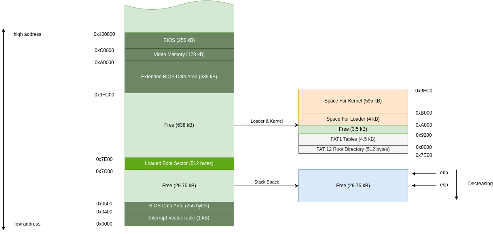
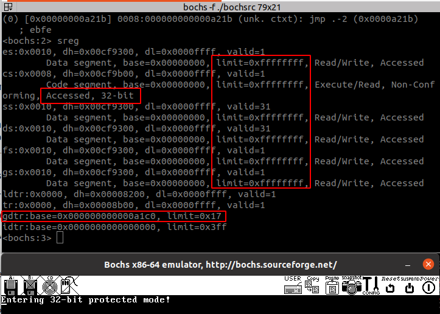

# Loader Program

This markdown file is to record the developing process of the loader program, and explain some of the details that I have learned through the process of my learning.

## Objectives

The operating system starts from the boot program, which has a limitation of 512 bytes, you can not do much with it, so the primary goal of boot program is to load the loader program to the RAM and jump to the right address to run the loader program. Therefore, the responsibility of loader program is to switch from 16-bit real mode, to 32-bit mode and further 64-bit mode. The reason behind this is obvious, more bits means more memory can be addressed, as well as IO device, which will also be mapped into memory, especially in Embedded Systems.

In order to switch to the 32-bit mode, we will divided this process into different stages:

1. Modify the loader program to load a temp `kernel.bin` (written in assembly)  **16-bit Real Mode**
2. Modify the loader program to switch to 32-bit protected mode and then write a simple 32-bit `kernel.bin` (written in assembly)
3. Rewrite the kernel program with `C` language

We will spend some time on `32-bit` protected mode to develop a basic kernel before we move to the `64-bit` mode.

## Kernel In 16-bit Real Mode

### Memory Arrangement

Before we start working on the first mile-stone mentioned above, we need to redesign the memory spaces with some detailed explanation:



Because the stacks for the functions grows downwards, so we put the base pointer to the `0x7c00` to use the Free space from `0x0500` to `0x7C00`

Then we Leave some spaces for FAT root directory and the `FAT1` table, for searching and loading purpose.

Finally we leave `4KB` for the loader program, and leave the rest to the kernel program.

**Note:**

The reason why we only use the memory of below `0x100000` is that the segment model, the register for real mode is 16-bit wide each, however the CPU has 20 wire lines for address. So software engineers think of a way to use two 16-bit registers to represent a 20-bit address called memory segmentation:

```bash
BaseAddress << 16 + OffsetAddress

; For example 0x7C00 be expressed
0x07C0:0x0000
9x0000:0x7C00
....


The upper limit for 20 address lines are `0x1000000`, We will learn how to address up to `4GB` memory in the future.

### Code Explanation

1. Up on jump to the loader to execute, there is a piece of code that set up the segment registers

```asm
Label_Loader_Start:
    mov ax, cs            ; get the current value of code segment
    mov es, ax            ; assign to es register
    mov ax, 0x00          ; assign 0 to ax
    mov ss, ax            ; assign 0 to stack segment
    mov ds, ax            ; assign 0 to data segment
    mov sp, 0x7c00        ; set stack pointer
    
; segment registers can be displayed when you type sreg in bochs
<bochs:3> sreg
es:0x0a00, dh=0x00009300, dl=0xa000ffff, valid=1
	Data segment, base=0x0000a000, limit=0x0000ffff, Read/Write, Accessed
cs:0x0a00, dh=0x00009300, dl=0xa000ffff, valid=1
	Data segment, base=0x0000a000, limit=0x0000ffff, Read/Write, Accessed
ss:0x0000, dh=0x00009300, dl=0x0000ffff, valid=7
	Data segment, base=0x00000000, limit=0x0000ffff, Read/Write, Accessed
ds:0x0000, dh=0x00009300, dl=0x0000ffff, valid=3
	Data segment, base=0x00000000, limit=0x0000ffff, Read/Write, Accessed
fs:0x0000, dh=0x00009300, dl=0x0000ffff, valid=1
	Data segment, base=0x00000000, limit=0x0000ffff, Read/Write, Accessed
gs:0x0000, dh=0x00009300, dl=0x0000ffff, valid=1
	Data segment, base=0x00000000, limit=0x0000ffff, Read/Write, Accessed
ldtr:0x0000, dh=0x00008200, dl=0x0000ffff, valid=1
tr:0x0000, dh=0x00008b00, dl=0x0000ffff, valid=1
gdtr:base=0x00000000000f9af7, limit=0x30
idtr:base=0x0000000000000000, limit=0x3ff
<bochs:4> 

; we should know that in real mode, the address is located with base << 16 + offset
; and the base address are stored in these segment registers
; in protected mode and beyond they will point to a more secure data structure called
; segment descriptor
```

2. We should notice that, the function `Func_CmpKernelName` use `si` to store the address, which means this function will locate variable with following format, so if you get the wrong value, remember to check this register!

```asm
; ds stands for data segment
ds << 16 + si
```


As for the rest of the code it's basically the same with the boot sector to load loader to the RAM, but someone may say that why do I load `FAT1` sectors twice (boot once, and loader once). The reason is that I considered that there maybe future modification of the memory arrangement for the loader program, so I keep this piece of code so that whenever I want, I can change the macro directly!

## Kernel In 32-bit Protected Mode

Though it's fun to coding kernel with 16-bit real mode, but due to the limited addressing space, eventually we will switch to the 32-bit protected mode.

### Main Differences in 32-bit Protected Mode

* Registers are extended to 32 bits, but the lower 16 bits and 8 bits are still independently accessible. (`EAX, AX, AL`)
* Two additional general purpose segment registers provided, `fs` and `gs`
* 32-bit memory offsets are available, so an offset can reference a whopping `4GB` of memory (`0xffffffff`)
* The CPU supports a more complex but safe memory segment model.
* Interrupt handling is more sophisticated.
* BIOS routines are no longer supported. (Which means 32-bit operating system must provide its own drivers for all hardware of the machine)

### Construct `GDT`

The 32-bit protected mode based on the structure Global Descriptor Table (`GDT`), so we have to understand what is the setup of the `GDT`

#### Global Descriptor Table (`GDT`)

Recall the segment model used in 16-bit mode, we simply multiply the base address by 16 (shift left by 4 bits), then we add the offset to get the physical address.

Now we decide to translate the logical address based on the information provided by a data structure called **segment descriptor (`SD`)**. We put the index of a particular segment descriptor to the segment register.

------

**Segment Descriptor:**

8-byte structure that defines the following properties

* Base address (32 bits), defines where the segment begins in physical memory
* Segment Limit (20 bits), defines the size of the segment
* Various flags (status indicator)


------

#### `GDT` Descriptor

The `CPU` needs to know  how long our `GDT` is and the actual switch operation only accept one address, so we will need another data structure to describe the `GDT`, called `GDT` descriptor, which is a 6-byte structure containing:

* `GDT` size (16 bits)
* `GDT` address (32 bits)

#### Defining the `GDT` in Assembly

```asm
GDT_Start:
GDT_Null: ; 8 bytes null GDT entry
    dd 0x0 ; the mandatory null descriptor for debug
    dd 0x0

GDT_Code: ; the code segment descriptor
    ; base address = 0x0, limit = 0xffff (which will be controled by Granularity)
    ; 1st flags: (P)1 (DPL)00 (TYPE)1 -> 1001b
    ; type flags: (code)1 (conforming)0 (readable)1 (accessed)0 -> 1010b
    ; 2nd flags: (graularity)1 (32-bit default)1 (64-bit seg) 0 (AVL) 0 -> 1100b
    dw 0xffff       ; Limit (bits 0-15)
    dw 0x0          ; Base (bits 0-15)
    db 0x0          ; Base (bits 16-23)
    db 10011010b    ; 1st flags, type flags
    db 11001111b    ; 2nd flags, Limit (bits 16-19)
    db 0x0          ; Base (bits 24-31)

GDT_Data: ; the data segment descriptor
    ; same as the code segment except for the type flags
    ; type flags: (code) 0 (expands down)0 (wrtable)1 (accessed)0 -> 0010b
    dw 0xffff       ; Limit (bits 0-15)
    dw 0x0          ; Base (bits 0-15)
    db 0x0          ; Base (bits 16-23)
    db 10010010b    ; 1st flags, type flags
    db 11001111b    ; 2nd flags, Limit (bits 16-19)
    db 0x0          ; Base (bits 24-31)

GDT_End:

; GDT descriptor
GDT_Descriptor:
    dw GDT_End - GDT_Start - 1  ; size of GDT
    dd GDT_Start                ; start address of GDT

; jump address for far jump
CODE_SEG equ GDT_Code - GDT_Start
DATA_SEG equ GDT_Data - GDT_Start
```

### Making the switch

There are a few steps in the process of making the switch to `32-bit` protected mode [3]

1. we need to enable the `A20` line [4]
2. disable the interrupts
3. load `GDT`
4. set the `PE (Protected Enable)` control bit of `CR0` (control register 0)
5. far jump to force `CPU` to clear it's pipeline

#### Enable the `A20` line

The `A20` Address Line is the physical representation of the 21st bit (number 20, counting from 0) of any memory access. When the `IBM-AT (intel 286)` was introduced, it was able to access 16 MB of memory, compared to 1 MB of the `intel 8086`.  In order to remain compatible with the 8086, which would also compatible to the older program developed in `16-bit` Real mode, we would need the ability to switch between `A0 ~A19` and `A20 ~ higher`. For the details of addressing model as well as the history of `A20` you can reference [4] [5].

There are many ways of enabling the `A20` line, we choose to write to I/O port 92, bit 1 to enable it.

```asm
; open address A20
in al, 0x92
or al, 0b00000010
out 0x92, al
```

#### Disable the Interrupts

The reason why we need to disable interrupts before we enter the Protected Mode lies on the hardware design [6], you can find more information from  https://archive.org/details/bitsavers_intel80386ammersReferenceManual1986_27457025

For my explanation, in `16-bit` real mode, we rely on interrupts to do various operations, but in `32-bit` protected mode we use interrupts differently, the system would reply on exception and a bunch of subroutines defined to handle these exceptions, so before entering `32-bit` protected mode, we need to disable interrupts first, this will ensure atomicity of certain operations to prevent interrupt-related issues during critical sections of code.

```asm 
cli
```

#### Load `GDT`

In the previous section we have already defined `GDT` in assembly, right now we only need to load the `GDT Descriptor` to the special register using `lgdt`. notice that when using `lgdt` we are still in `16-bit` Real mode, so put your `GDT Descriptor` in the `.16` section, or you will face problem referencing it.

```asm
lgdt [GDT_Descriptor]
```

Set `PE` in `CR0`

After doing all the preparations, the actual switch is very easy to trigger, all you need to do is to set the `PE (Protection Enable)` bit in `CR0` Control register 0. [7]

```asm
; set PE bit of CR0
mov eax, cr0    ; When in 16-bit real mode, we can still use eax to operate 32-bit register
or al, 0x1
mov cr0, eax ; set PE (Protection Enable) bit in CR0 (Control Register 0)
```

#### Clear the Pipeline

Due to the design of `cpu`, a technology called **pipeline** was implemented, which will help to improve the efficiency, but in order to switch to `32-bit` mode, we would need the `cpu` to clear all its instruction currently fetched and pipelined. In order to do this, we can simply perform a far jump.

But we need to realise that we just load the `GDT` ,which means that when we referencing the address of the code, we would need to use the `segment selector`  as a offset.

```asm
; perform a far jump to force the CPU clear pipeline
jmp dword CODE_SEG:Func_PMStart
```

And in the `Func_PMStart` we need to set the initial value of the `segment register` as well we the stack pointer, the layout of the memory is mentioned in the previous diagram:

```asm
; ------------------------------------------------
; Function Name: Func_PMStart
; Description: Prepare the stacks and print messages
; Output:
;   - No return value
; ------------------------------------------------
Func_PMStart:
Label_InitStack:
    mov ax, DATA_SEG
    mov ds, ax
    mov ss, ax
    mov es, ax
    mov fs, ax
    mov gs, ax
    
    mov ebp, 0x7c00 ; update the stack position
    mov esp, ebp

Label_PrintWelMsg:
    mov ebx, PMMessage
    call Func_PrintString32
    jmp $ ; pending after print this message
```

#### Result

The result is shown as below, but what we need to know is that, we only construct the `GDT`, but the system has `tr, ldtr, idtr` which need to be implemented in the future!



# Reference

1. ##### https://wiki.osdev.org/Memory_management

2. https://wiki.osdev.org/GDT_Tutorial
3. https://wiki.osdev.org/Protected_Mode
4. https://wiki.osdev.org/A20_Line
5. https://en.wikipedia.org/wiki/A20_line
6. https://stackoverflow.com/questions/16536035/why-do-interrupts-need-to-be-disabled-before-switching-to-protected-mode-from-re
7. https://en.wikipedia.org/wiki/Control_register
8. 

2. https://www.stanislavs.org/helppc/int_10-0.html
